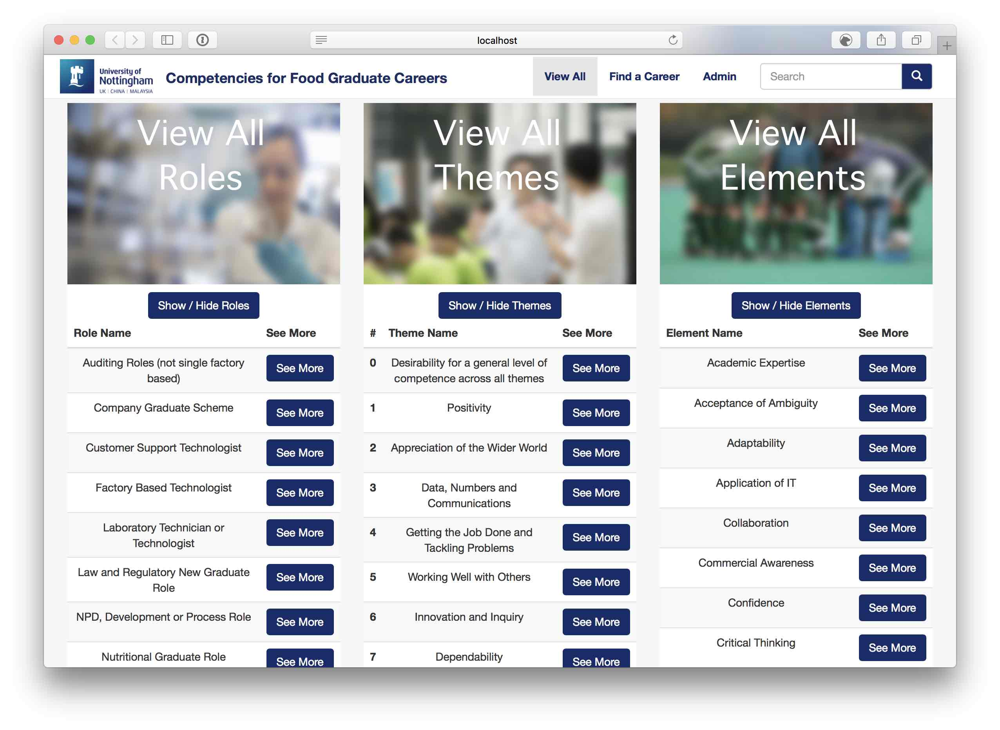
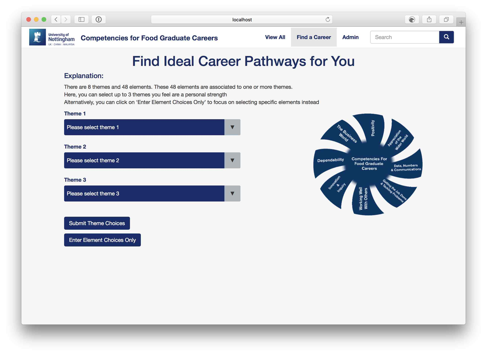
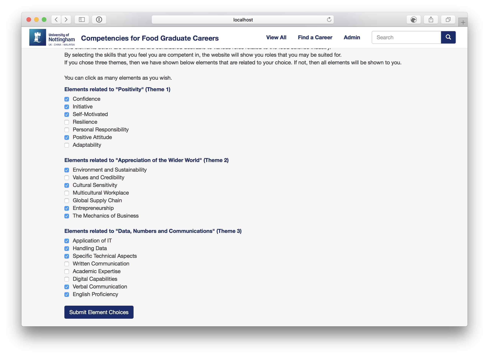
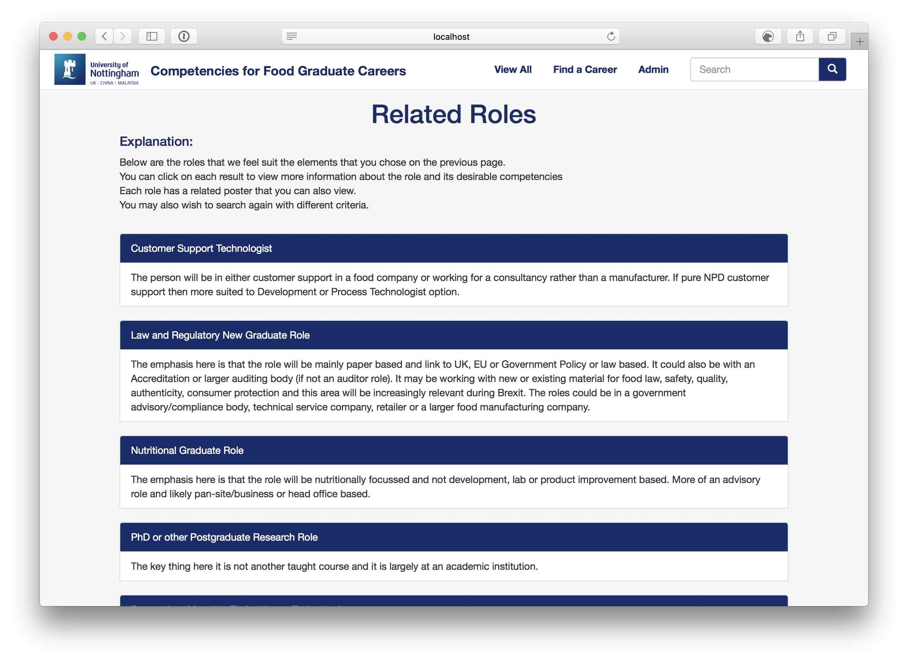
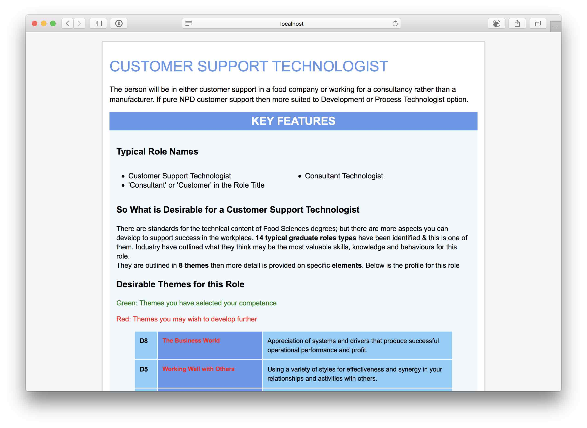
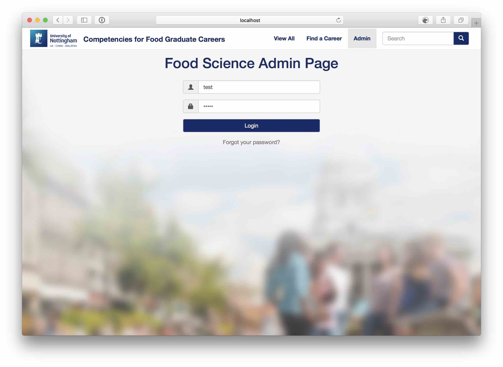
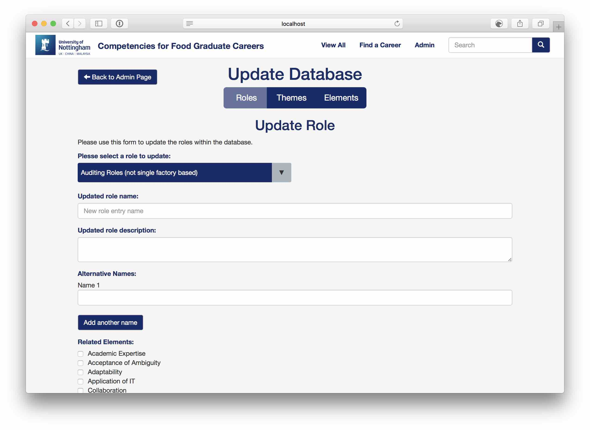
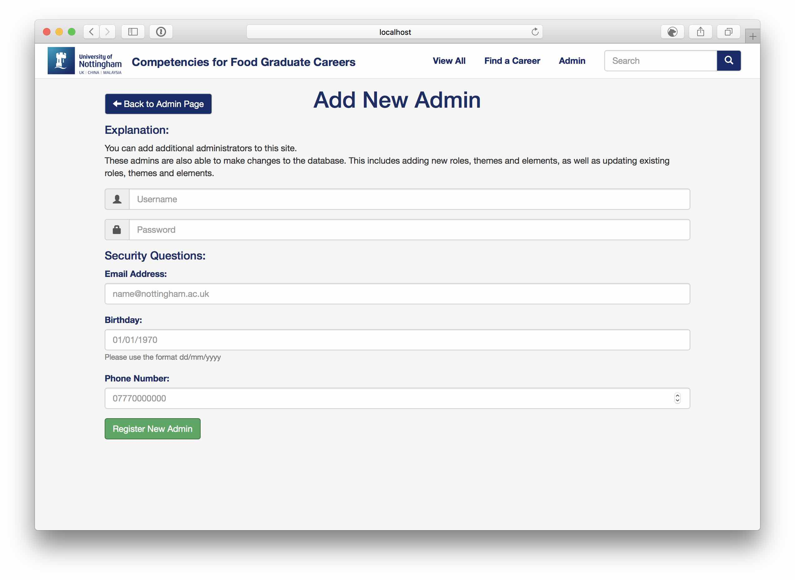
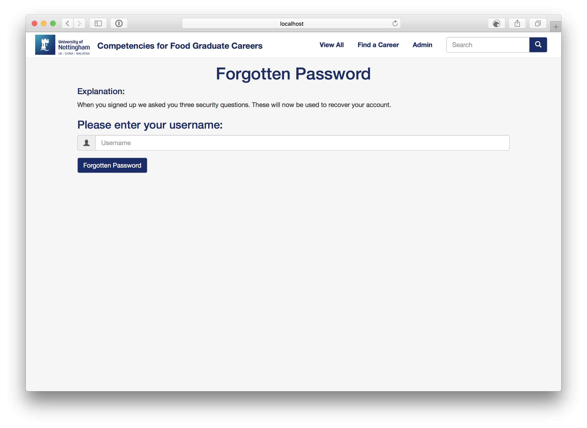
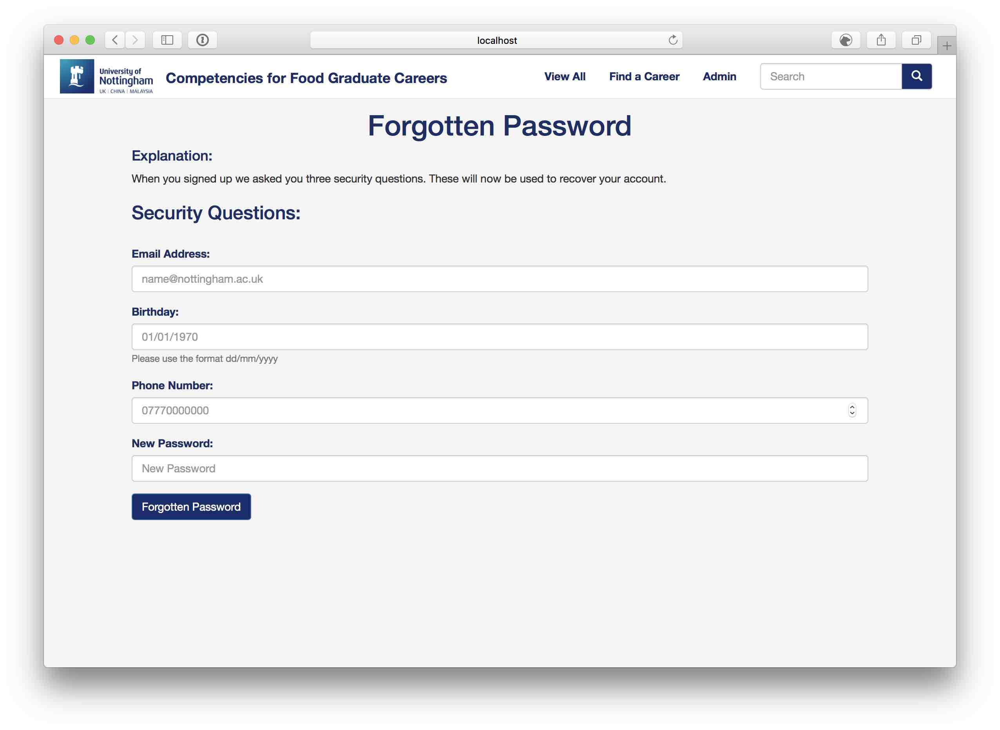

# G52GRP - Group 35
A compentence evaluating system for Food Science graduates.

## Members

- Alexander Hambley Jones (Leader)
- Alexander Ferrandiz Hagbarth
- Hangjian Yuan
- Lee Ryan Taylor
- Victor Walker


- Peter Blanchfield (Supervisor)
- Emma Weston (Sponsor)

## Documentations

### Trello

(To view you must have been invited)

| Board | Link |
| - | - |
| Planning | https://trello.com/b/W1guhkC1 |
| Coding   | https://trello.com/b/vjlo6bSZ |
| TDD      | https://trello.com/b/AQ639kJH |


### Dropbox

https://www.dropbox.com/sh/62o9vtykx57vlge/AABwtHlL5VeTuGXVegT_d3iXa?dl=0

### Gantt Chart

https://app.teamweek.com/#pg/xHNPnwNcWA8nuJm5--z6gqOOQ6nH1IIo

## Features

- Comprehensive themes
- User-friendly interface
- Lightweight architecture

## Useful for...
- Graduates of Food Science
- Undergraduates of Food Science
- Lecturers in Food Science

## Installation

⚠️ If you are installing this software, please read the entire readme, and not just this installation section.

1) Install [XAMPP](https://www.apachefriends.org/index.html) or set up a [LAMP](https://www.digitalocean.com/community/tutorials/how-to-install-linux-apache-mysql-php-lamp-stack-on-ubuntu-16-04) stack.

2) Clone the git repository.
  * Save this to your _htdocs_ folder. (The installer should tell you where this is)

3) Make sure that localhost is running.
  * You can do this by either running XAMPP, and then entering your public IP (or typing in localhost).   
  * If you are running a LAMP stack, then browse to your server's public IP.

4) If you are running XAMPP, then you should be greeted with a webpage similar to this:

  

5) Browse to PHPMyAdmin (_your-public-ip/phpmyadmin_) and create a new database called `g52grp`.
  * Please note that the database **must** be named `g52grp`:


  * Your PHPMyAdmin may be password protected. Log in, and we will deal with that later.

6) Import the SQL file '_/grp/src/data/foodgraduates.sql_'.


7) If your PHPMyAdmin is password protected, then you will have to add these credentials to the `db.php` and `credentials.php` files.

* There is not much to change, just add your username and password to these files.
*  They should be similar to this afterwards:
  * `credentials.php`
  ```php
  <?php
      $db_host = 'localhost';
      $db_username = 'YOUR-USERNAME';
      $db_password = 'YOUR-PASSWORD';
      $db_database = 'g52grp';
  ?>
  ```
  * `db.php`
  ```php
  <?php
  $conn = new mysqli("localhost", "YOUR-USERNAME", "YOUR-PASSWORD", "g52grp");
  if ($conn->connect_errno != 0)
    die('Failed to connect to the database.');
  ```

8) You will now need to set up a new admin user in order to edit the database.
  * We first need to create a hash of your chosen password.
  * Create a new php file with the following php code inside:
  ```php
  <?php
  echo hash('sha256', 'YOUR PASSWORD HERE');
  ?>
  ```

  * Save this as `password.php` and browse to it by the following:  '_your-public-ip/grp/src/password.php_'

  * Copy this result.
  * In PHPMyAdmin, go to the users table on the left hand side, and click Browse. You should have a page like below:


  * Edit the following SQL command to contain the attributes that you want. Remember to use the hash that you generated for the password.

    ```sql
    INSERT INTO 'users' (Name, Password, Phone, Email, Birthday)
    VALUES ("USERNAME", "PASSWORD", "PHONE NUMBER" "EMAIL", "BIRTHDAY")
    ```

  * Press the Edit Inline link and paste your SQL command in, pressing 'Go'.

9) Make sure you delete the password.php file.

10) That's it! You should be all set up and able to log in to the admin portion of the site.

## Using the Site

1) The index / landing page
  * This page should look like below. This page gives an overview of all the roles, themes and elements that are present in the database.
  * This page is really useful if you already know what roles, themes or elements you want to see are.
  * To see the roles, themes or elements, just press the blue **Show / Hide** button.
  * We can see that a search bar is circled. This lets you search for anything in the database. This includes alternative names for the roles.


  * After pressing the **Show / Hide** button, we can see a list of all roles, themes and elements.



  * By pressing **See More**, we can see more information about that particular item in the database.


2) The 'Find a Career' page
  * This page is intended for penultimate and final year students. We developed this page taking into account feedback from current students.
  * The idea is that you choose three themes that you feel that you are particularly proficient at.



  * Then you are greeted with two or three sets of elements related to your chosen themes.
  * You then choose the associated elements that you feel that you are proficient at.



  * The site will return a list of results that we feel you may be particularly geared towards. You can click on these to get more information.




* You can see even more information by clicking the **See More** button.



* You're then given a detailed page - the key thing here is that themes and elements may be highlighted in green or red.
  * Green themes and elements are those that you have selected in the process of getting to this page.
  * Red themes and elements are those that you have not selected, and may wish to consider if you are interested in this career in the future.
* It is also possible to download a form of this page in a PDF format.

3) The admin pages
  * These pages are intended for the admin of the site to easily be able to add, update or delete role, themes and elements.



* The index page allows you to easily and quickly manage the database.


* Below is what you will see if you were to add something to the database:


* Below is what you will see if you were to update something in the database:




 * Below is what you will see if you were to delete something in the database.
  * Please note the danger of deleting something in the database. ⚠️
  * You **cannot** undo this action, and you will have to add the items back into the database manually, or by using the tools shown above.


* You can also add new users to the database, also making them admins.
  * Please note that any user you add will also be able to add, update and remove elements, along with adding new admins. ⚠️



* Forgotten Password
  * It is also possible to recover your account in the case of a forgotten password.
  * Please keep in mind that anyone with direct access to the SQL database will be able to recover your account as well, therefore it is a good idea to secure this database. ⚠️




4) Search Results
  * Present on every page is the navbar and the search bar.
  * This search bar allows you to search for roles, themes and elements.


Thanks for reading the readme file.
